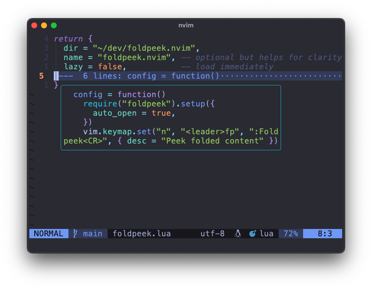

# foldpeek.nvim



`foldpeek.nvim` is a Neovim plugin designed to enhance your workflow by providing advanced folding and peeking capabilities.

## Features

- **Advanced Folding**: Intelligently fold code blocks for better readability.
- **Peek Functionality**: Quickly preview folded sections without unfolding them.
- **Auto Open**: Automatically peek into folded sections when the cursor hovers over them (configurable).

## Installation

Use your favorite Neovim plugin manager to install `foldpeek.nvim`. For example, using [lazy.nvim](https://github.com/folke/lazy.nvim):

```lua
require('lazy').setup({
  { 'walkingshamrock/foldpeek.nvim' }
})
```

## Usage

Add the following configuration to your `init.lua` or `init.vim`:

```lua
require('foldpeek').setup({
  auto_open = true, -- Automatically peek into folds on CursorHold
})
```

### Commands

- `:Foldpeek`: Manually peek into the folded section under the cursor.

### Auto Open

When `auto_open` is enabled, the plugin will automatically peek into folded sections when the cursor hovers over them for a moment (triggered by the `CursorHold` event).

## Configuration

The `setup` function accepts a configuration table. Below are the available options:

- `auto_open` (boolean): If `true`, automatically peek into folds on `CursorHold`. Default is `false`.

Example:

```lua
require('foldpeek').setup({
  auto_open = false, -- Default behavior: manual peeking only
})
```

## License

This plugin is licensed under the MIT License. See the `LICENSE` file for details.
